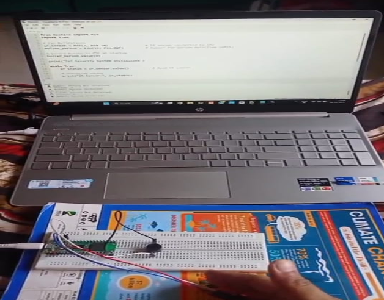
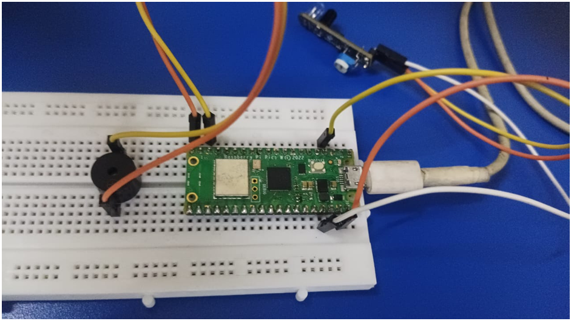
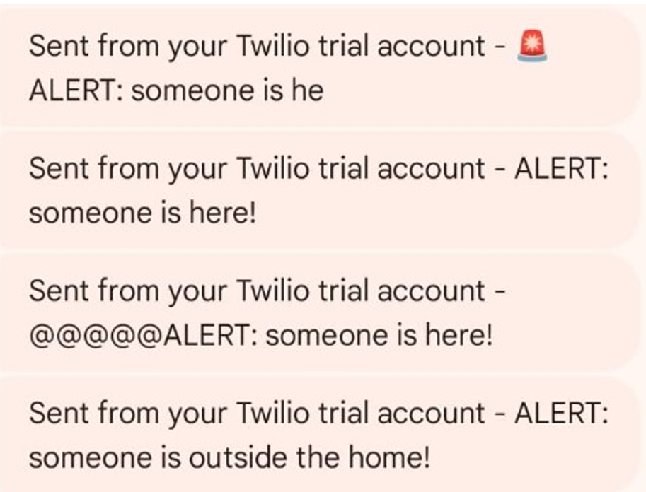
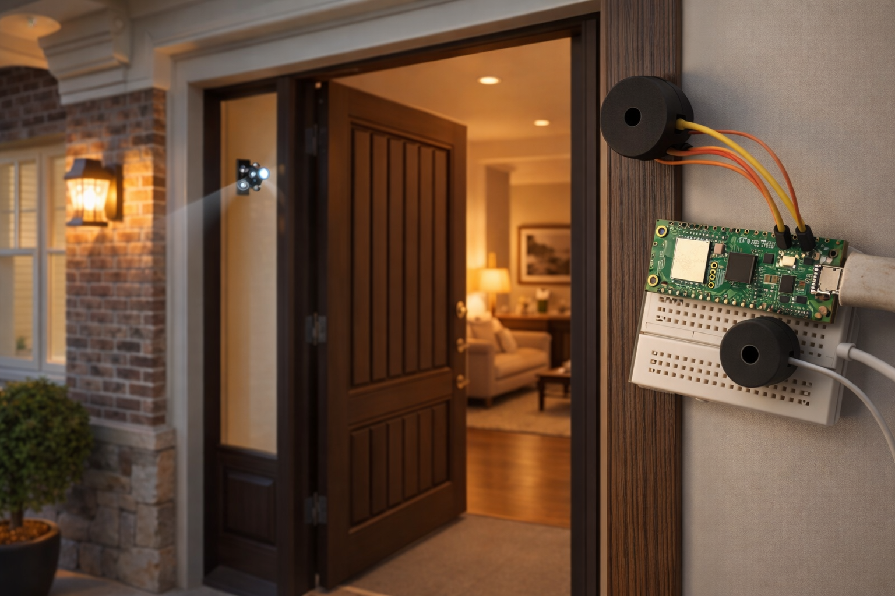

# 🏠 IoT Smart Home & Alert System using Raspberry Pi Pico W

An **IoT-based Smart Home and Alert System** that detects human motion at the home entrance using **PIR / IR sensors** and sends **instant alert messages via Twilio SMS**.  
The system also triggers a **buzzer alert** for local warning and works wirelessly using **Wi-Fi**.

---

## 📌 Project Description

This project enhances **home security** by detecting motion near the door.  
When motion is detected:
- A **buzzer** alerts locally
- An **SMS alert** is sent to the homeowner using **Twilio**

The system is built using **Raspberry Pi Pico W** and programmed in **MicroPython** using **Thonny IDE**.

---

## ✨ Features

- 🚶 Motion detection using PIR / IR sensor  
- 📢 Buzzer alert for intruder detection  
- 📩 SMS notification using Twilio API  
- 🌐 Wi-Fi enabled (Raspberry Pi Pico W)  
- ⚡ Low power & real-time alert system  
- 🏡 Smart Home security application  

---

## 🧰 Hardware Components

- Raspberry Pi Pico W  
- PIR / IR Motion Sensor  
- Buzzer  
- Breadboard  
- Jumper Wires  
- USB Cable  

---

## 💻 Software & Tools

- Thonny IDE  
- MicroPython  
- Twilio API (SMS service)  
- Wi-Fi Network  

---
## MicroPython Setup – Step Titles

- Download and Install Thonny IDE

- Download MicroPython Firmware for Raspberry Pi Pico W

- Flash MicroPython Firmware on Pico W

- Configure Thonny Interpreter for Pico W

- Verify MicroPython Installation
---
## Twilio SMS Setup – Step Titles

- Create a Twilio Account

- Verify Mobile Number

- Get Twilio Account SID and Auth Token

- Obtain Twilio Phone Number

- Configure Twilio Credentials in MicroPython Code

- Send SMS Alert Using Twilio API

## 🔌 Circuit Connections

### PIR / IR Sensor
| Sensor Pin | Pico W Pin |
|----------|------------|
| VCC | 3.3V |
| GND | GND |
| OUT | GP15 |

### Buzzer
| Buzzer Pin | Pico W Pin |
|-----------|------------|
| + | GP14 |
| - | GND |

---

## ⚙️ Working Principle

1. PIR / IR sensor monitors motion near the door  
2. When motion is detected:
   - Buzzer turns ON
   - SMS alert is sent via Twilio  
3. User receives alert on mobile phone  
4. System resets and continues monitoring  

---

## 📲 Twilio SMS Alert

Example Alert Message:
Twilio is used to send real-time SMS notifications when motion is detected.

---
## 📸 Project Demo Images
## Simulation / Code Execution (Thonny)
 
## Hardware Connection 
 
## SMS Alert Message (Twilio SMS)
 
## Final Smart Home View
 

---
## 🤝 Need Help?

Have questions about hardware, MicroPython, Wi-Fi, or Twilio SMS?  
👉 Feel free to **open an issue** — I’m happy to help 😊

## 📬 Connect With Me

  
  
  

⭐ If this project helped you, don’t forget to star the repo!

---
Made with ❤️ using Raspberry Pi Pico W & MicroPython 🚀

